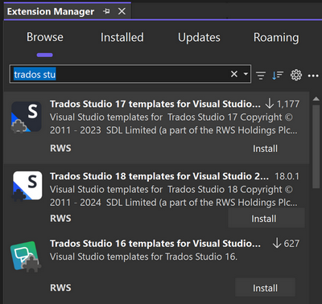
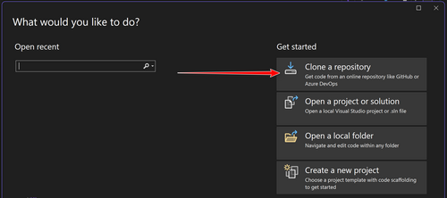
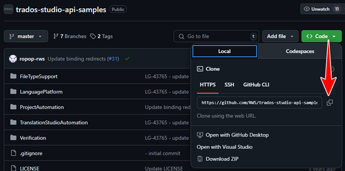
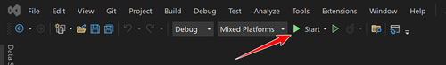
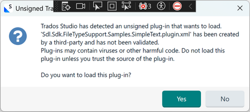
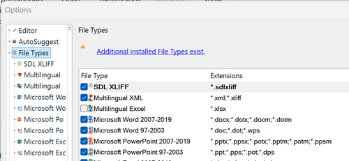
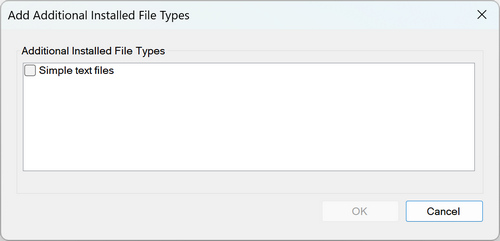
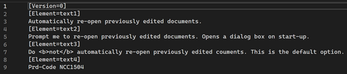

# 01 - Getting Started

If you want to create plugins or tools for Trados Studio, you'll need to set up your computer properly. This guide explains the basics in simple terms.

## **What You Need**

1. **Windows**
    Trados Studio only works on Windows, so you need Windows 10 or later.

2. **Visual Studio**
    You don't have to, but you'll save yourself a lot of difficulties if you're not experienced by using Microsoft Visual Studio to write and build your code.

   - Recommended version: Visual Studio 2022 Community Edition (free)
   - During installation, make sure to select the ".NET desktop development" workload

3. **.NET Framework**
    Trados Studio plugins require .NET Framework 4.8 (at the time of writing). This is usually installed automatically when you install the correct Visual Studio workload.

4. **Trados Studio Plugin Template**
    The easiest way to get started is by installing the official plugin template for Trados Studio inside Visual Studio.
    Here's how to do it:

- Open Visual Studio  
- Go to **Extensions > Manage Extensions**  
- Search for "Trados Studio Plugin Template"  
  
- At the time of writing you'll find the extensions for Trados Studio 2021, 2022 and 2024
- Download the one you need and restart Visual Studio when prompted


   

   ### **What the Trados Studio Plugin Template Does for You**

   1. **Sets Up the Correct Project Structure**
       It automatically creates a Visual Studio solution with the correct folders, references, and configuration needed to build a Trados Studio plugin. This saves you from having to manually set up things like `packages.config`, the plugin manifest, or the output folders.
   2. **Includes Required References**
       It adds references to the key Trados Studio assemblies (DLLs) that your plugin will need to access the public APIs. This includes references like `Sdl.Desktop.IntegrationApi`, `Sdl.TranslationStudioAutomation.IntegrationApi`, and others.
   3. **Targets the Right .NET Framework and Platform**
       It sets the project to use **.NET Framework 4.8** and ensures it builds for **x86 (32-bit)**, which is essential since Trados Studio is currently a 32-bit application.
   4. **Adds a `.sdlplugin` Packaging Step**
       It includes a post-build event that packages your compiled code and required resources into a `.sdlplugin` file, which is the format Studio uses for plugins. You can install this file into Studio by double-clicking it.
   5. **Keeps You Aligned with Best Practices**
       Because it’s maintained by RWS, it follows their recommended guidance for plugin development and helps avoid common setup errors (e.g. incorrect manifest, missing files, wrong target platform).

   Without the extension, you would have to set up all of this manually, including referencing the correct versions of Studio’s DLLs and configuring the packaging logic. The extension removes this burden so you can focus on the plugin logic itself.

## Finding the Sample Templates

The Trados Studio Developer Experience Team (aka the AppStore Team) have [provided some samples](https://github.com/RWS/trados-studio-api-samples) that make use of several of the APIs and this is kept up to date with contributions from the core development teams as well:

- **FileTypeSupport**
  - *This is used when creating or extending file type filters. It lets you define how Trados Studio handles custom file formats (e.g. parsing, segmentation, preview, writing target files). If you're building support for a non-standard file format, this is what you'd work with.*
- **LanguagePlatform**
  - *This provides access to core language processing features, such as translation memories, termbases, and segment-level operations. You'd use this if your plugin needs to interact with TM lookups, concordance searches, or term recognition.*
- **ProjectAutomation**
  - *This is for working with projects and batch tasks in Trados Studio. You can use it to create projects, run batch tasks (e.g. pre-translate or analysis), or access project settings programmatically. It's commonly used for automating project workflows.*
- **TranslationStudioAutomation**
  - *This lets you interact with the Studio editor itself, including opening documents, navigating between segments, or reading and modifying content while a file is open. If your plugin needs to work live inside the editor (e.g. custom translation suggestions or commands), this is the relevant API.*
- **Verification**
  - *This is for building custom QA checkers. It allows you to define rules that check the quality of translated content (e.g. inconsistent punctuation, missing tags) and report issues during the verification phase. Useful for extending Studio’s built-in QA functionality.*

The best way to make use of these is to set up your development environment in Visual Studio and clone the repository to a local folder on your computer... I'd recommend you don't use a OneDrive location for this!

### **How to Clone a Repository in Visual Studio**

1. **Open Visual Studio**

   - Start Visual Studio (e.g. Visual Studio 2022).

2. **Open the 'Clone a Repository' Window**

   - From the **Start Window**, click on **"Clone a repository"**  
     
     
     (If you already have a solution open, go to **File > Clone Repository...**)

3. **Enter the Repository URL**

   - Paste the **HTTPS or SSH URL** of the repository you want to clone  
     (e.g. `https://github.com/RWS/trados-studio-api-samples.git`)  
     

4. **Choose the Local Path**

   - Select a folder on your machine where you want to store the local copy of the repo.

5. **Click 'Clone'**

   - Visual Studio will download the repository and open it automatically.

That’s it. You can now explore the code, build the solution, or start making changes.

## **Making Sure Everything Works**

Once you've cloned the repository, it’s a good idea to test that everything builds and runs as expected. For this walkthrough, I’ll use the **FileTypeSupport** sample.

Go to **File > Open > Project/Solution**, navigate to the `FileTypeSupport` folder, and open the `Sdl.Sdk.Samples.sln` solution file.

This will load all the File Type Support plugin samples. I’m particularly interested in `Sdl.Sdk.FileTypeSupport.Samples.SimpleText`, as it’s a straightforward example to understand how things are structured. But before diving into the code, I want to make sure my development setup is compatible with building and running plugins for Trados Studio.

---

### **Step 1: Unload the Project**

Before doing anything else, I unload the project so I can inspect the `.csproj` file.

Right-click on `Sdl.Sdk.FileTypeSupport.Samples.SimpleText` and select **Unload Project**. If successful, the project will show as *(unloaded)* in the Solution Explorer, and the `.csproj` file will open in the **Code Editor**.

This lets me check a few key things:
- What .NET Framework it targets (in this case, 4.8).
- Whether the project is set for `x86` or `AnyCPU` - important because **Trados Studio is a 32-bit application**.
- What SDKs, references, and NuGet packages are in use.

It also prevents Visual Studio from trying to restore packages or build the project prematurely. Once I’ve confirmed that the project is correctly set up (and this sample usually is), I can close the `.csproj` file and reload the project.

---

### **Step 2: Reload and Build the Project**

Right-click the unloaded project and choose **Reload Project**.

Now, right-click again and choose **Build**. This step is essential because:

1. **The `.sdlplugin` package is created during the build**  
   The setting `<CreatePluginPackage>true</CreatePluginPackage>` (in the  `.csproj` file we looked at earlier) triggers a custom build task that creates the plugin package.

2. **It compiles everything**  
   All source files, references, and resources are compiled into a DLL and bundled correctly.

3. **It checks for setup problems**  
   If anything’s missing or incompatible (like the wrong .NET version), the build will fail - giving you a chance to fix it early.

4. **It deploys the plugin**  
   The build process also copies the generated `.sdlplugin` file to the correct Studio plugin folder via the `<PluginDeploymentPath>` setting.

In short: reloading makes the project editable again, but **building** actually compiles and deploys it so Studio can use it.

---

### **Step 3: Set as Startup Project**

Since I’m just getting started, I also want to set things up so I can run or debug the plugin directly from Visual Studio.

Right-click on `Sdl.Sdk.FileTypeSupport.Samples.SimpleText` and choose **Set as Startup Project**.

#### **Why this matters:**

1. **To launch Trados Studio with debugging enabled**  
   This allows me to step through my plugin code, set breakpoints, and see how it behaves when Studio loads it.

2. **To tell Visual Studio what to run**  
   Only one project can be the startup project. If I don’t set this, pressing `F5` won’t do anything meaningful.

3. **To configure launch behaviour**  
   This step also enables me to specify Trados Studio as the program to run when starting the debugger.

---

### **Step 4: Set the External Program Path**

Now I tell Visual Studio to launch Trados Studio when I start debugging.

Right-click the project, select **Properties** (or press `Alt+Enter`).

Go to the **Debug** tab, and under **Start external program**, browse to:

```
C:\Program Files (x86)\Trados\Trados Studio\Studio18\SDLTradosStudio.exe
```

This makes sure Studio starts when I hit the **Start** button in Visual Studio.

Close the Properties window – now you’re ready to run and debug your plugin directly within Studio.



---

### **Watch Out for Plugin Signing Warnings**

When Studio launches, you might see this warning:



That’s because your plugin isn’t signed. All production plugins must be signed to avoid this message.

When you publish your plugin to the **RWS AppStore**, the **AppStore Manager** will sign it for you. You can then download and use it – even privately – without publishing it publicly.

But during development, this message will keep appearing every time you build. That’s perfectly normal and a good reminder that you’re still working with a development build.

---

### **Check That Your File Type Plugin Has Loaded**

Once Studio opens, go to:

**File > Options > File Types**

You should see a message like:

> “Additional installed File Types exist”



Click it, and you should find your new File Type in the list – ready to be added to your options.



Click it, and you’re good to go.

---

### **Final Tip: Use the Sample File**

In your project folder, you’ll find a file called `sample.text`. Use this to test your plugin.



It’s a simple test file designed to trigger the key parts of the plugin – especially useful when you begin exploring how file recognition and tagging works in the code.

---

Good luck!
